# Assembly Instructions

Before assembling the board, ensure you have all of the required parts.

* Top cover / Plate PCB
* Assembled keyboard PCB
* Laser cut acrylic - 4 pieces
* 2 * Rotary encoders (20mm recommended)
* 2 * Rotary encoder knobs
* 4 * 4mm M2 cap head bolts (bare-bones 8 * 4mm)
* 4 * 8mm M2 cap head bolts
* 4 * 8mm female threaded standoffs (bare-bones 10mm)
* 4 * Rubber feet (optional)
* 17-20 * Cherry MX Key Switches (not shown) (3 pin switches required for 2U keys)
* 17-20 * 1U Cherry MX Keycaps (not shown)
* 0-3 * Screw In Stabilisers (not shown)

You will also require the following:

* Soldering iron and solder
* 1.5mm allen key
* Dielectric Grease (to lube stabilisers)

If you are assembling the bare-bones version, follow the below steps but omit the acrylic parts.

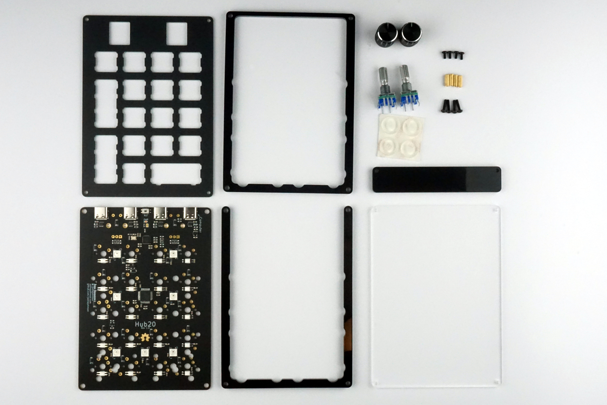

### Step 0: Check PCB

Whilst we do our best to ensure the PCBs work, there may be issues that slip through QC or the boards may be damaged in freight. As such you should test the PCB before continuing.

Boards come preloaded with VIA for testing, and using their "Key Tester -> Test Matrix" option is the easiest way to ensure the board works. `If VIA does not automatically detect your HUb20, follow ` [these](via.md) `instructions to load the config file so the board can be detected.`

**Check the key switches by using tweezers to short the key switch pins together.**  
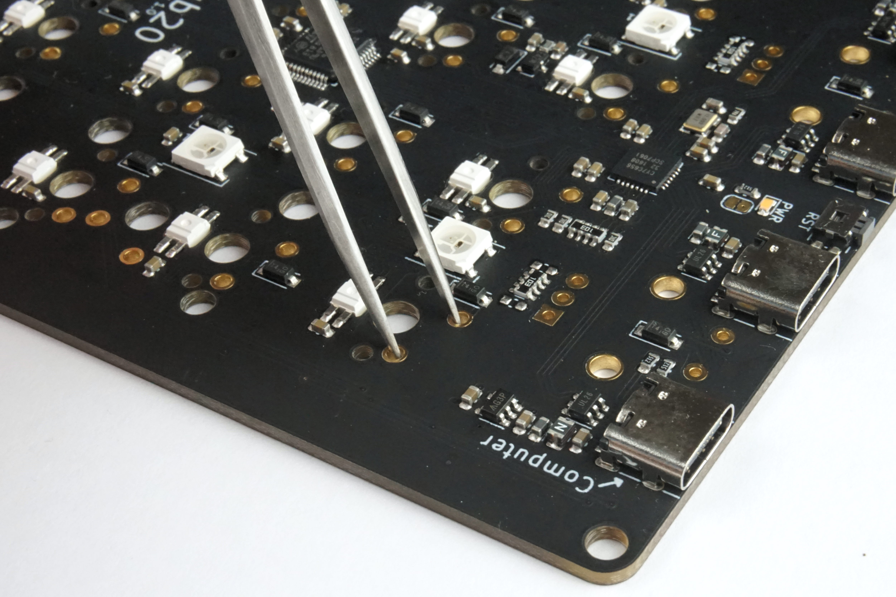

**Check the encoders by placing encoder against pins and rotating.**  
You may need to angle the encoder down to ensure it has good contact. Also test the encoder switch by shorting the two pins towards the top of the PCB.

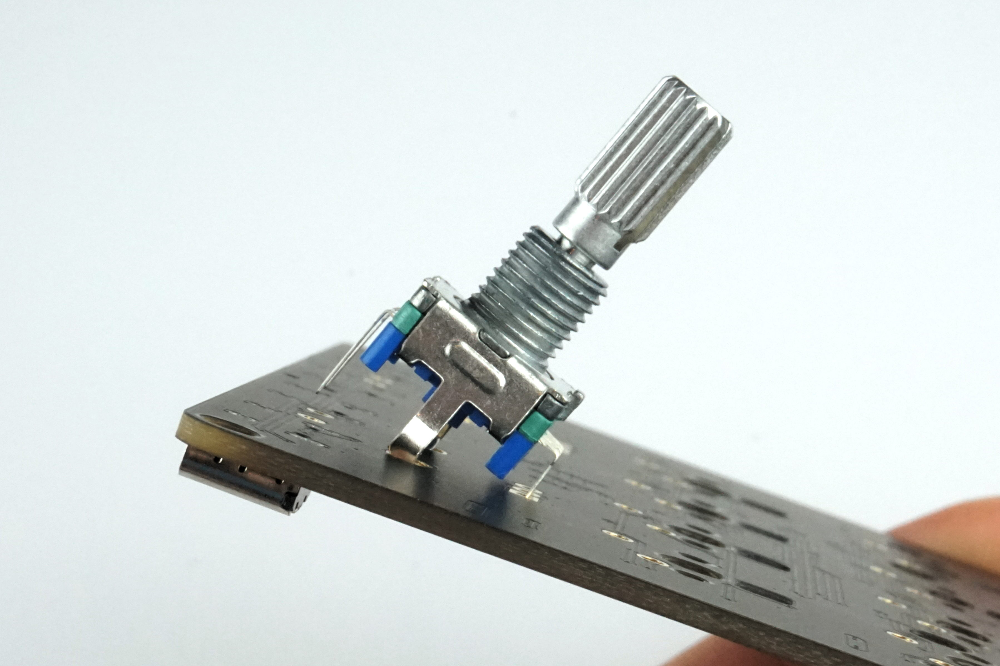

**Check the USB hub by connecting a device to each port, with cable orientated in both orientations.**  
You should see a your device appear on each port.

### **If there are any issues getting the above to work, please get in touch before proceeding to assemble the board.**

### Step 1: Solder Encoders

The first step in assembling your Hub20 is to solder the rotary encoders. Ensuring the pins are straight, insert the rotary encoders and tack in two pins on opposite corners.
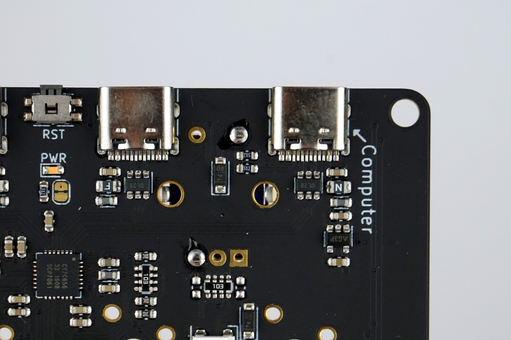

Before soldering in the remaining pins, ensure the encoder is perpendicular. If adjustments are required, heat one of the solder joints and gently push the encoder until it is seated. Repeat until you are satisfied with how the encoders look. (Hint: you shouldn't be able to see the encoder hiding on the other side of the board!)
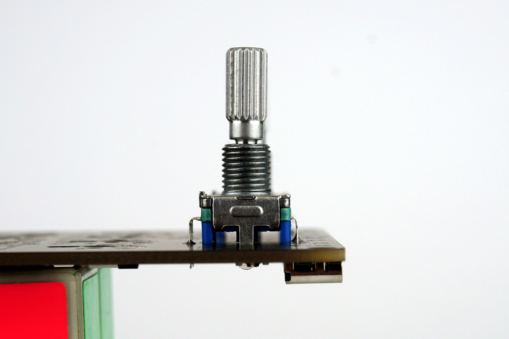

With your encoders in nice and square, solder the rest of the pins. I'd suggest soldering all of the smaller pins and checking everything is still square before soldering in the mechanical legs as they make it very hard to move the encoder.
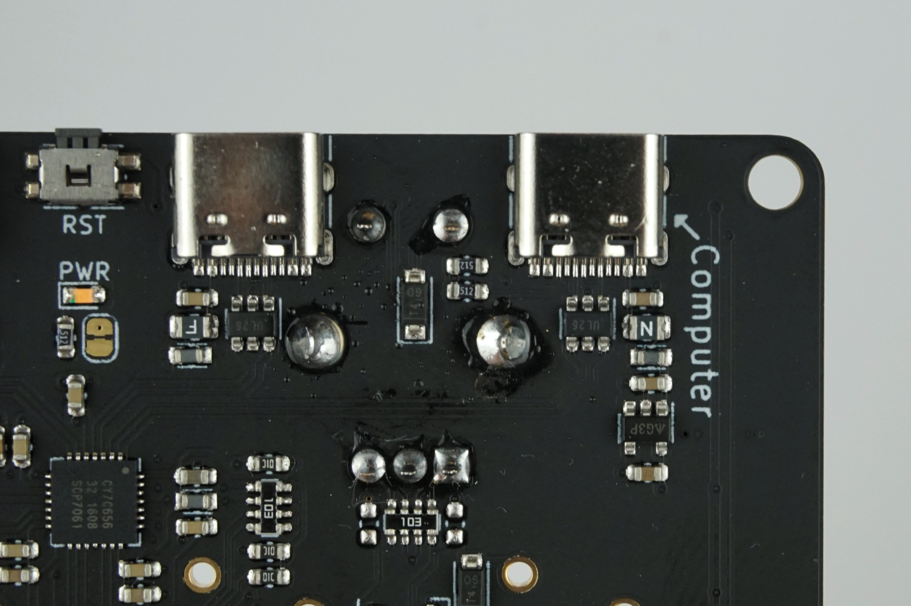

### Step 2: Install Stabilisers

Stabilisers are required for all of the "2U" switches, as they prevent the keys from wobbling. Before installing, I highly recommend you [lubricate your stabilisers](https://youtu.be/cD5Zj-ZgMLA) as otherwise they will rattle. If you don't want to go through the hassle of the above video, just make sure you [lube the wires](https://youtu.be/cD5Zj-ZgMLA?t=185) as this is the largest contributor to noise.

Depending on if you configure the board as a left or right numpad (or a 4x5 grid, in which case you can skip this) you will need to place the stabilisers in different locations. Left image is for the left numpad config, right image is for the right numpad configuration.

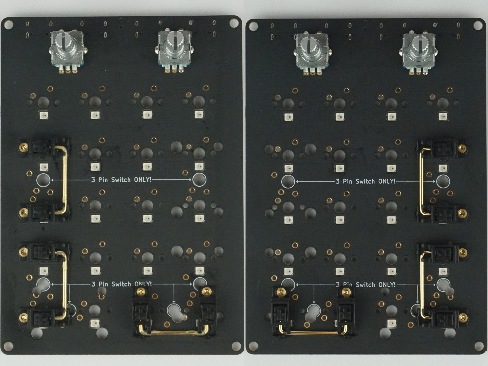

When installing the stabilisers, ensure you use the non-conductive washers which are included. This prevents the screws from contacting with the PCB and causing shorts or damaging traces.

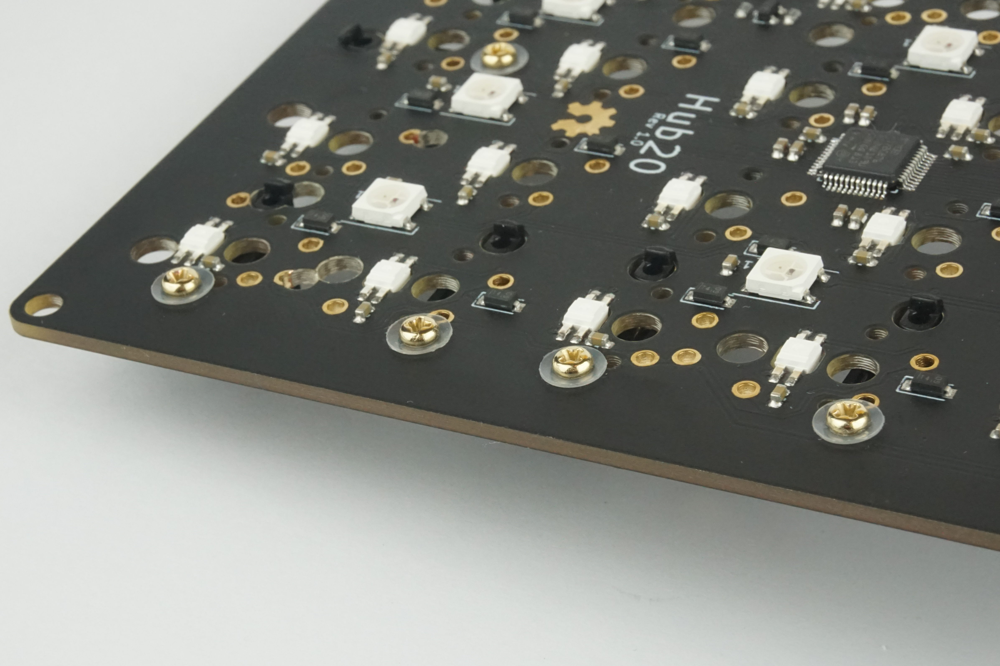

### Step 3: Assemble upper case

With the encoders soldered and stabilisers installed, the next step is to thread the standoffs into the shorter screws through the top plate. Just do this up touch tight, as we may need to loosen it later.
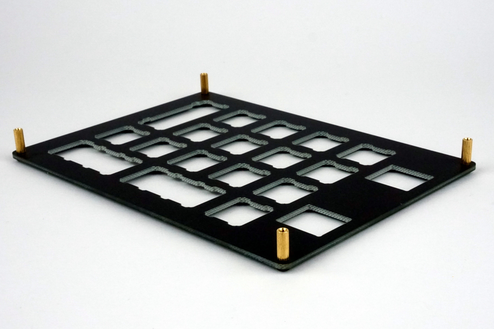

### Step 4: Add "O" shaped spacer

Add the "O" shaped spacer, ensuring the cutouts are towards the bottom as they provide clearance for the stabilisers.
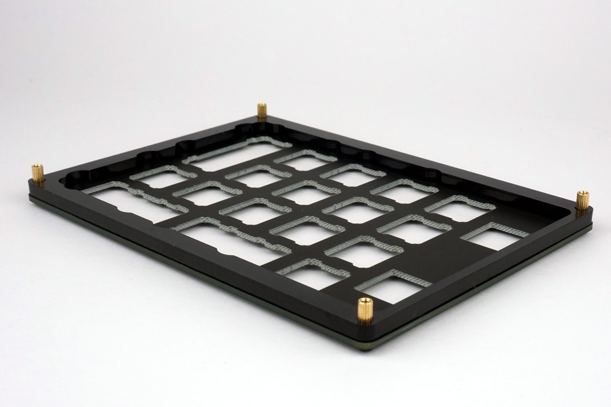

### Step 5: Place PCB into case, and solder switches

Place the PCB into the case, followed by a switch in each corner to hold it in place.
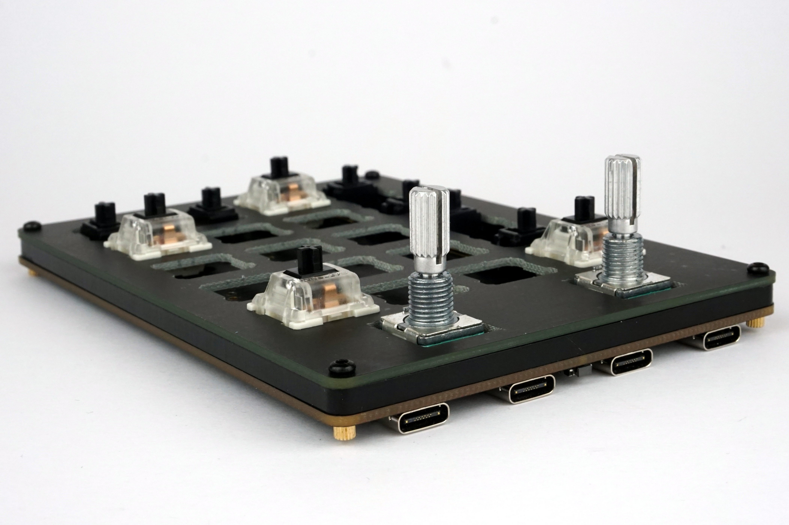

Tack one pin from each switch in place to keep everything together, and check for gaps along the side of the case. If there are gaps, press the case together whilst heating the soldered pin and the case should squish together. Once everything is flush, add the remaining keys and solder.
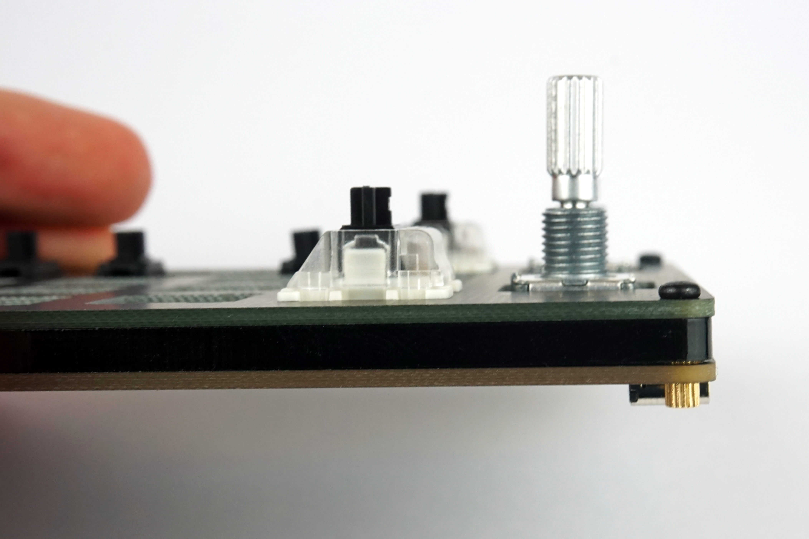

### Step 6: Add "U" shaped spacer

Place the remaining "U" shaped acrylic spacer on top of the PCB, ensuring the open end faces towards the USB connectors.
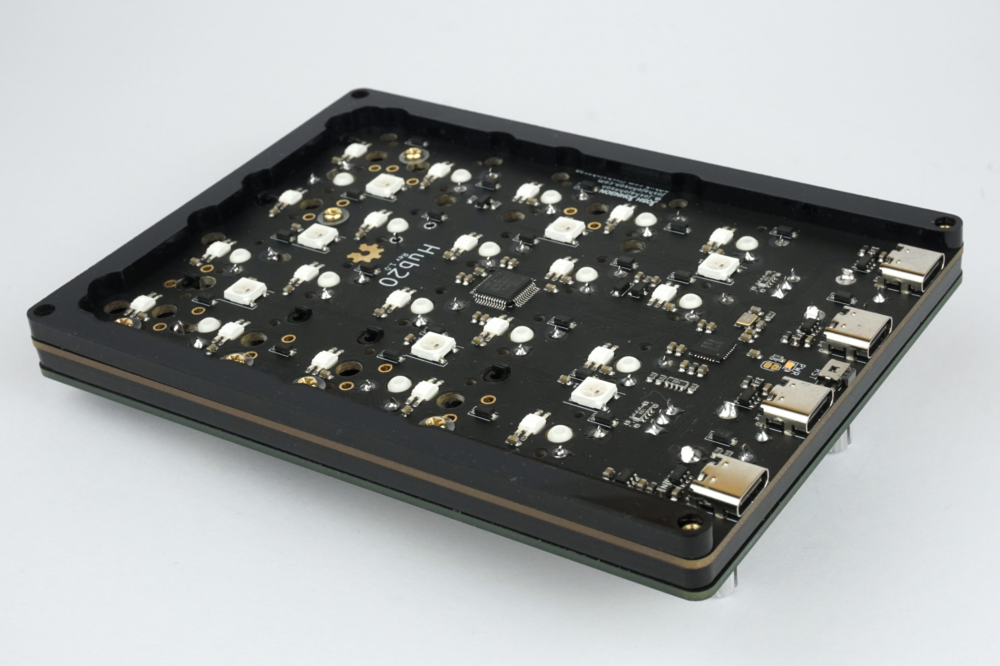

### Step 7: Add bottom plate and remaining screws

When installing the bottom plate, if you choose to use the small riser you will need to back off the screws so the female standoff can sit flush to the spacer (image is not flush but pretend it is). If you are not installing the riser, or are installing the bottom two bolts, this step is not required.
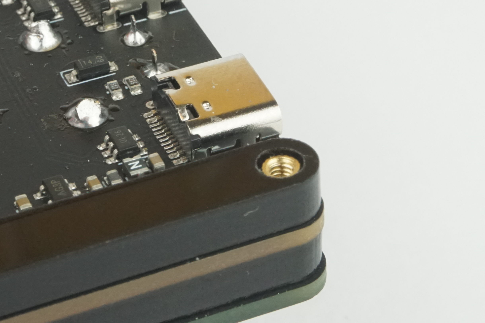

After installing the bottom plate and screws, snug all of the bolts up and your Hub20 is now assembled!
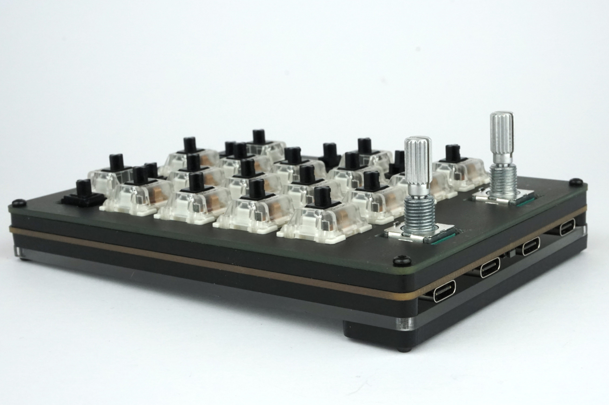

### Step 8: Add keycaps and encoder knobs

Finally, fit your keycaps of choice and the encoder knobs, and you are done! Enjoy :D

## Disabling Power LED

If you find the power LED annoying and would like to disable it, cut the jumper near the USB ports. The easiest way to do this is to run a knife down the thin black gap between the two large pads. The LED can be re-enabled by soldering the jumper shut.

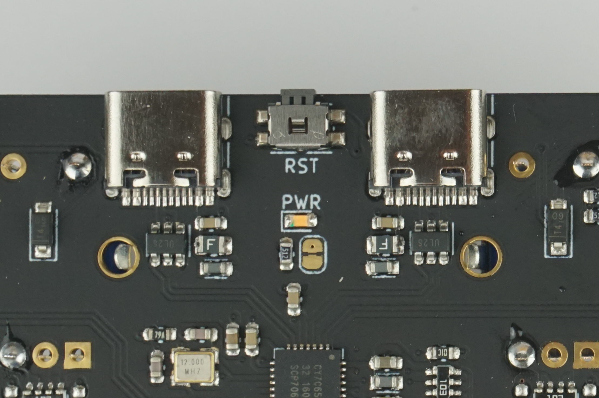
